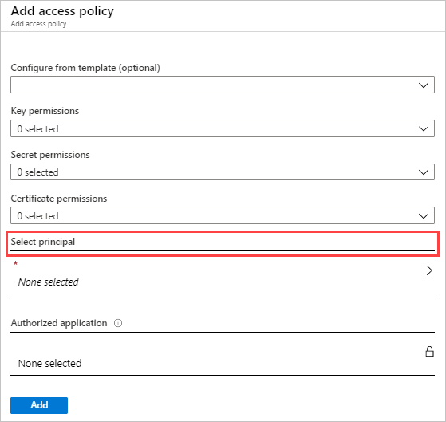
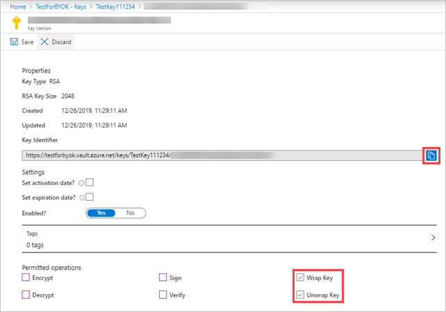

---
# required metadata
title: Encrypt Defender for Cloud Apps data at rest with your own key
description: This article provides instructions for using your own key to encrypt data at rest stored in Defender for Cloud Apps.
ms.topic: conceptual
ms.date: 07/13/2022

---
# Encrypt Defender for Cloud Apps data at rest with your own key (BYOK)

This article describes how to configure Defender for Cloud Apps to use your own key to encrypt the data it collects, whilst it's at rest. If you are looking for documentation about applying encryption to data stored in cloud apps, see [Azure Information Protection integration](azip-integration.md).

Defender for Cloud Apps takes your security and privacy seriously. Therefore, once Defender for Cloud Apps starts collecting data, it uses its own managed keys to protect your data in accordance with our [data security and privacy](/cas-compliance-trust.md) policy. Additionally, Defender for Cloud Apps allows you to further protect your data at rest by encrypting it with your own Azure Key Vault key.

> [!IMPORTANT]
> If there is a problem accessing your Azure Key Vault key, Defender for Cloud Apps will fail to encrypt your data and your tenant will be lock down within an hour. When your tenant is locked down, all access to it will be blocked until the cause has been resolved. Once your key is accessible again, full access to your tenant will be restored.

## Prerequisites

You must register the **Microsoft Defender for Cloud Apps - BYOK** app in your tenant's Azure Active Directory (Azure AD) associated with your Defender for Cloud Apps tenant.

### To register the app

1. Install [Azure Active Directory PowerShell for Graph](/powershell/azure/active-directory/install-adv2).

1. Open a PowerShell terminal and run the following commands:

    ``` Powershell
    Connect-AzureAD
    New-AzureADServicePrincipal -AppId 6a12de16-95c8-4e42-a451-7dbbc34634cd
    Set-AzureADServicePrincipal -ObjectId <object_id> -AccountEnabled true
    ```

    Where *<object_id>* is the object ID returned by the previous command (`New-AzureADServicePrincipal`).

> [!NOTE]
>
> - Defender for Cloud Apps encrypts data at rest for all new tenants.
> - Any data that resides in Defender for Cloud Apps for more than 48 hours will be encrypted.

## Deploy your Azure Key Vault key

1. Create a [new Key Vault](/azure/key-vault/general/quick-create-portal#create-a-vault) with the **Soft-delete** and **Purge protection** options enabled.

1. In the new generated Key Vault, open the **Access policies** pane and then select **+Add Access Policy**.
    1. Select **Key permissions** and choose the following permissions from the dropdown menu:

        | Section | Required permissions |
        | --- | --- |
        | Key Management Operations | - List |
        | Cryptographic Operations | - Wrap key<br />- Unwrap key |

        

    2. Under **Select principal**, choose **Microsoft Defender for Cloud Apps - BYOK**.

        

    3. Select **Save**.

1. Create a [new RSA key](/azure-stack/user/azure-stack-key-vault-manage-portal#create-a-key) and do the following:

    > [!NOTE]
    > Only RSA keys are supported.

    1. After creating the key, select the new generated key, select the current version and then you'll see **Permitted operations**.

    1. Under **Permitted operations**, make sure the following options are enabled:

        - Wrap key
        - Unwrap key

    1. Copy the **Key Identifier** URI. You'll need it later.

    

1. Optionally, if using a firewall for a selected network, configure the following firewall settings to give Defender for Cloud Apps access to the specified key, and then click **Save**:
    1. Make sure no virtual networks are selected.
    1. Add the following IP addresses:
        - 13.66.200.132
        - 23.100.71.251
        - 40.78.82.214
        - 51.105.4.145
        - 52.166.166.111
        - 13.72.32.204
        - 52.244.79.38
        - 52.227.8.45
    1. Select **Allow trusted Microsoft services to bypass this firewall**.

    

## Enable data encryption in Defender for Cloud Apps

When you enable data encryption, Defender for Cloud Apps immediately uses your Azure Key Vault key to encrypt data at rest. Since your key is essential to the encryption process, it is important to ensure that your designated Key Vault and key are accessible at all times.

### To enable data encryption

1. In Defender for Cloud Apps, in the menu bar, click the settings cog  and select **Settings**.

1. Select the **Data encryption** tab.

1. Select **Enable data encryption**.

1. In the **Azure Key Vault key URI** box, paste the key identifier URI value you copied earlier.

    > [!NOTE]
    > Defender for Cloud Apps always uses the latest key version, regardless of the key version specified by the URI.

1. Once the URI validation has completed, select **Enable**.

> [!NOTE]
> When you disable data encryption, Defender for Cloud Apps removes the encryption with your own key from the data at rest. However, your data remains encrypted by Defender for Cloud Apps managed keys.
>
> **To disable data encryption:** Go to the **Data encryption** tab and click **Disable data encryption**.

## Key roll handling

Whenever you create new versions of the key configured for data encryption, Defender for Cloud Apps automatically rolls to the latest version of the key.

## How to handle data encryption failures

If there is a problem accessing your Azure Key Vault key, Defender for Cloud Apps will fail to encrypt your data and your tenant will be lock down within an hour. When your tenant is locked down, all access to it will be blocked until the cause has been resolved. Once your key is accessible again, full access to your tenant will be restored. For information about handling data encryption failures, see [Troubleshooting data encryption with your own key](ems-cloud-app-security-govt-service-byok-troubleshoot.md).
