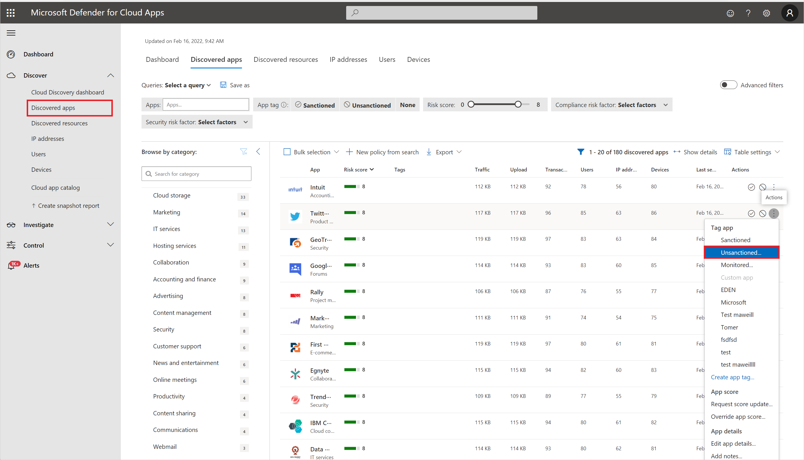
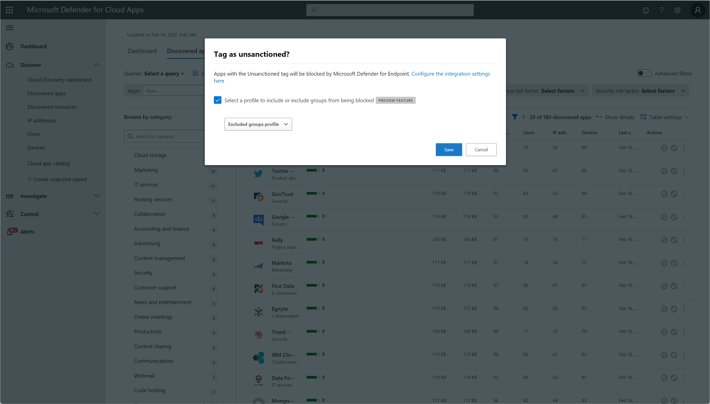
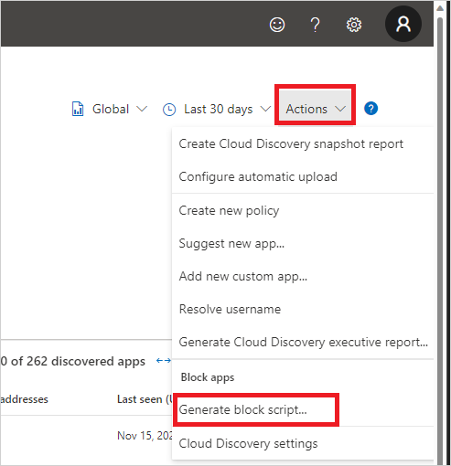

# Govern discovered apps

[!INCLUDE [Banner for top of topics](includes/banner.md)]

After you've reviewed the list of discovered apps in your environment, you can secure your environment by approving safe apps (**Sanctioned**) or prohibiting unwanted apps (**Unsanctioned**) in the following ways.

##  Sanctioning/unsanctioning an app

You can unsanction a specific risky app by clicking the three dots at the end of the row. Then select **Unsanction**. Unsanctioning an app doesn't block use, but enables you to more easily monitor its use with the Cloud Discovery filters. You can then notify users of the unsanctioned app and suggest an alternative safe app for their use, or  [generate a block script using the Defender for Cloud Apps APIs](api-discovery-script.md) to block all unsactioned apps.

> [!NOTE]
> If your tenant uses Microsoft Defender for Endpoint, Zscaler NSS, or iboss, any app you mark as unsanctioned is automatically blocked by Defender for Cloud Apps, and the following sections regarding creating blocking scripts are unnecessary. For more information, see [Block apps with Microsoft Defender for Endpoint](https://docs.microsoft.com/en-us/defender-cloud-apps/governance-discovery#block-apps-with-defender-for-endpoint), [Integrate with Zscaler](zscaler-integration.md), and [Integrate with iboss](iboss-integration.md) respectively.

## Block apps with Defender for Endpoint

Defender for Cloud Apps enables you to block access to unsanctioned apps by using Defender for Endpoint. You can block all devices in your organization, or block specific device groups.

> [!NOTE]
> The option to block specific device groups via include or exclude is in **Preview** mode.

### Prerequisites

1. One of the following licenses:

   - Defender for Cloud Apps (E5, AAD-P1m CAS-D) and Microsoft Defender for Endpoint [Plan 2](/microsoft-365/security/defender-endpoint/defender-endpoint-plan-1-2)
   - Microsoft 365 E5
1. Onboarded machines: Windows 10 version 18.09 (RS5), OS Build 1776.3 or later.
1. [Onboard Defender for Cloud Apps with Defender for Endpoint](mde-integration.md#how-to-integrate-microsoft-defender-for-endpoint-with-defender-for-cloud-apps).

### Blocking apps

To block usage for specific device groups, do the following steps:

1. Go to Defender for Cloud Apps.

1. Under **Settings**, choose **Apps tags** and go to **Scoped profiles**.

1. Select **Add profile**. The profile sets the entities scoped for blocking/unblocking apps.

1. Provide a descriptive profile name and description.

1. Choose whether the profile should be an **Include** or **Exclude** profile.

    - **Include**: only the included set of entities will be affected by the access enforcement. For example, the profile *myContoso* has **Include** for device groups A and B. Blocking app Y with the profile *myContoso* will block app access only for groups A and B.

    - **Exclude**: The excluded set of entities won't be affected by the access enforcement. For example, the profile *myContoso* has **Exclude** for device groups A and B. Blocking app Y with the profile *myContoso* will block app access for the entire organization except for groups A and B.

1. Select the relevant device groups for the profile.

1. Select **Save**.

    

To block an app, do the following steps:

1. In Defender for Cloud Apps, under **Discover**, go to the **Discovered apps** page.

1. Select the app that should be blocked.

1. Tag the app as **Unsanctioned**.

    

1. To block all the devices in your organization, select **Save**. To block specific device groups in your organizations, select **Select a profile to include or exclude groups from being blocked**. Then choose the profile for which the app will be blocked, and select **Save**.

    

> [!NOTE]
>
> - The enforcement ability is based on Defender for Endpoint’s custom URL indicators.
> - Any organizational scoping that was set manually on indicators that were created by Defender for Cloud Apps before the release of this feature will be overridden by Defender for Cloud Apps. The required scoping should be set from the Defender for Cloud Apps experience using the scoped profiles experience.
> - To remove a selected scoping profile from an unsanctioned app, remove the unsanctioned tag and then tag the app again with the required scoped profile.
> - It can take up to two hours for app domains to propagate and be updated in the endpoint devices once they're marked with the relevant tag or/and scoping.

## Block apps by exporting a block script

Defender for Cloud Apps enables you to block access to unsanctioned apps by using your existing on-prem security appliances. You can generate a dedicated block script and import it to your appliance. This solution doesn't require redirection of all of the organization's web traffic to a proxy.

1. In the Cloud Discovery dashboard, tag any apps you want to block as **Unsanctioned**.

    

2. In the title bar, select the three dots and select **Generate block script...**.

    

3. In **Generate block script**, select the appliance you want to generate the block script for.

    

4. Then select the Generate script button to create a block script for all your unsanctioned apps. By default, the file will be named with the date on which it was exported and the appliance type you selected. *2017-02-19_CAS_Fortigate_block_script.txt* would be an example file name

   

5. Import the file created to your appliance.

## Next steps

> [!div class="nextstepaction"]
> [Daily activities to protect your cloud environment](daily-activities-to-protect-your-cloud-environment.md)

[!INCLUDE [Open support ticket](includes/support.md)]
