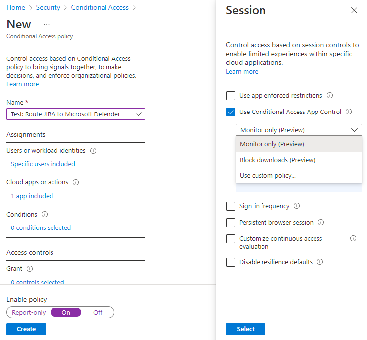
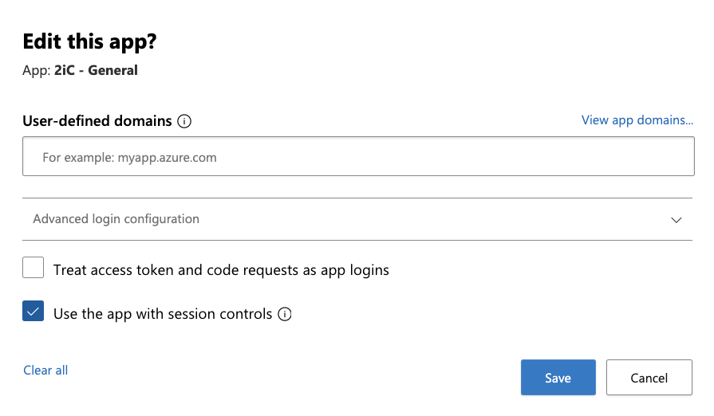

# Deploy Conditional Access App Control for catalog apps with Azure AD

[!INCLUDE [Banner for top of topics](includes/banner.md)]

Access and session controls in Microsoft Defender for Cloud Apps work with applications from the Cloud app catalog and with custom applications. For a list of apps that are pre-onboarded and work out of the box, see [Protect apps with Defender for Cloud Apps Conditional Access App Control](proxy-intro-aad.md#pre-onboarded-apps).

## Prerequisites

- Your organization must have the following licenses to use Conditional Access App Control:

   - [Azure Active Directory (Azure AD) Premium P1](/azure/active-directory/fundamentals/license-users-groups) or higher
   - Microsoft Defender for Cloud Apps
- Apps must be configured with single sign-on
- Apps must use one of the following authentication protocols:

   |IdP|Protocols|
   |---|---|
   |Azure AD|SAML 2.0 or OpenID Connect|
   |Other|SAML 2.0|
   

## To deploy catalog apps

Follow these steps to configure catalog apps to be controlled by Microsoft Defender for Cloud Apps Conditional Access App Control.

**Step 1: [Configure Azure AD to work with Defender for Cloud Apps](#step-1-configure-azure-ad-to-work-with-defender-for-cloud-apps)**

**Step 2: [Sign in to each app using a user scoped to the policy](#sign-in-scoped)**

**Step 3: [Verify the apps are configured to use access and session controls](#portal)**

**Step 4: [Enable the app for use in your organization](#enable-app)**

**Step 5: [Test the deployment](#test)**

## Step 1: Configure Azure AD to work with Defender for Cloud Apps

### Configure integration with Azure AD

> [!NOTE]
> When configuring an application with SSO in Azure AD, or other identity providers, one field that may be listed as optional is the sign-on URL setting. Note that this field may be required for Conditional Access App Control to work.

Use the following steps to create an Azure AD Conditional Access policy that routes app sessions to Defender for Cloud Apps. For other IdP solutions, see [Configure integration with other IdP solutions](proxy-deployment-featured-idp.md).

1. In Azure AD, browse to **Security** > **Conditional Access**.
1. On the **Conditional Access** pane, in the toolbar at the top, select **New policy** -> **Create new policy**.
1. On the **New** pane, in the **Name** textbox, enter the policy name.
1. Under **Assignments**, select **Users or workload identities** and assign the users and groups that will be onboarding (initial sign-on and verification) the app.
1. Under **Assignments**, select **Cloud apps or actions** and assign the apps and actions you want to control with Conditional Access App Control.
1. Under **Access controls**, select **Session**, select **Use Conditional Access App Control**, and choose a built-in policy (**Monitor only (Preview)** or **Block downloads (Preview)**) or **Use custom policy** to set an advanced policy in Defender for Cloud Apps, and then select **Select**.

    

1. Optionally, add conditions and grant controls as required.
1. Set **Enable policy** to **On** and then select **Create**.

> [!NOTE]
> Before proceeding, make sure to first sign out of existing sessions.

After you've created the policy, sign in to each app configured in that policy. Make sure you sign in using a user configured in the policy.

Defender for Cloud Apps will sync your policy details to its servers for each new app you sign in to. This may take up to one minute.

The preceding instructions helped you create a built-in Defender for Cloud Apps policy for catalog apps directly in Azure AD. In this step, verify that the access and session controls are configured for these apps.

1. In the [Defender for Cloud Apps portal](https://portal.cloudappsecurity.com/), select the settings cog , and then select **Conditional Access App Control**.
1. In the Conditional Access App Control apps table, look at the **Available controls** column and verify that both **Access control** or **Azure AD Conditional Access**, and **Session control** appear for your apps.

   > [!NOTE]
   > If the app isn’t enabled for session control, you can add it by clicking the ‘Onboard with session control’ and checking 'Use this app with session controls'
   > 

Once you're ready to enable the app for use in your organization's production environment, do the following steps.

1. In Defender for Cloud Apps, select the settings cog , and then select **Conditional Access App Control**.
1. In the list of apps, on the row in which the app you're deploying appears, choose the three dots at the end of the row, and then choose **Edit app**.
1. Select **Use the app with session controls** and then select **Save**.

    

1. First sign out of any existing sessions. Then, try to sign in to each app that was successfully deployed. Sign in using a user that matches the policy configured in Azure AD, or for a SAML app configured with your identity provider.
1. In the [Defender for Cloud Apps portal](https://portal.cloudappsecurity.com/), under **Investigate**, select **Activity log**, and make sure the login activities are captured for each app.
1. You can filter by clicking on **Advanced**, and then filtering using **Source equals Access control**.

    

1. It's recommended that you sign into mobile and desktop apps from managed and unmanaged devices. This is to make sure that the activities are properly captured in the activity log.  
   To verify that the activity is properly captured, select a single sign-on login activity so that it opens the activity drawer. Make sure the **User agent tag** properly reflects whether the device is a native client (meaning either a mobile or desktop app) or the device is a managed device (compliant, domain joined, or valid client certificate).

> [!NOTE]
> After it is deployed, you can't remove an app from the Conditional Access App Control page. As long as you don't set a session or access policy on the app, the Conditional Access App Control won't change any behavior for the app.

## Next steps

> [!div class="nextstepaction"]
> [« PREVIOUS: Introduction to Conditional Access App Control](proxy-intro-aad.md)

> [!div class="nextstepaction"]
> [NEXT: Deploy Conditional Access App Control for any app »](proxy-deployment-any-app.md)

> [!div class="nextstepaction"]
> [Troubleshooting access and session controls](troubleshooting-proxy.md)

[!INCLUDE [Open support ticket](includes/support.md)]
